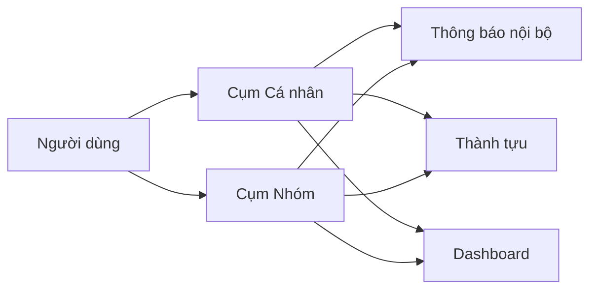
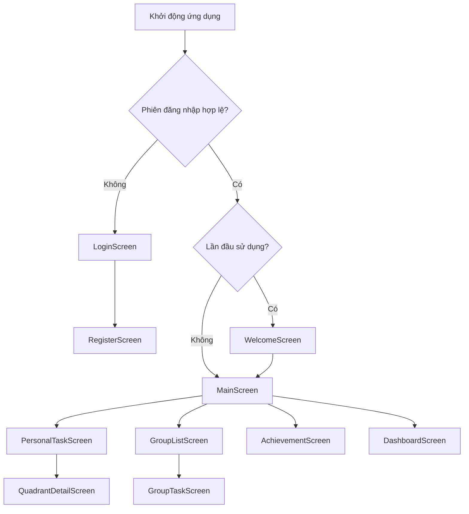

# Chức năng và giao diện hệ thống SyncTask

## Tổng quan màn hình

Ứng dụng được tổ chức thành 2 cụm chính:

1. **Cụm xác thực và khởi động**: `LoginScreen`, `RegisterScreen`, `WelcomeScreen`.
2. **Cụm vận hành nghiệp vụ** trong `MainScreen`: `Personal`, `Group`, `Achievement`, `Dashboard`.

## Bản đồ chức năng tổng thể

| Nhóm chức năng | Mục tiêu nghiệp vụ | Màn hình liên quan |
|---|---|---|
| Xác thực | Đăng ký, đăng nhập, xác thực email, đăng xuất | `LoginScreen`, `RegisterScreen`, `MainActivity` |
| Onboarding | Hướng dẫn sử dụng lần đầu, spotlight theo bước | `WelcomeScreen`, `SpotlightOverlay` |
| Cá nhân | Quản lý công việc cá nhân theo Eisenhower | `PersonalTaskScreen`, `QuadrantDetailScreen` |
| Nhóm | Tạo nhóm, tham gia nhóm, quản lý thành viên | `GroupListScreen`, `GroupTaskScreen` |
| Thành tựu | Theo dõi huy hiệu và mốc tiến độ | `AchievementScreen` |
| Thông báo | Nhận thông báo nội bộ và thông báo đẩy | `NotificationBottomSheet`, FCM service |
| Dashboard | Theo dõi hiệu suất theo thời gian | `DashboardScreen` |
| Thiết lập | Chủ đề sáng/tối, âm thanh, âm lượng | TopBar `MainScreen` |

## Chức năng Cá nhân có những gì

## Nghiệp vụ chính

1. **Tạo công việc cá nhân** với các thuộc tính:
   - Tiêu đề, mô tả.
   - Mức độ `isUrgent` và `isImportant`.
   - Hạn hoàn thành `dueDate`.
2. **Hiển thị theo ma trận Eisenhower** gồm 4 vùng:
   - Do Now (Khẩn cấp + Quan trọng).
   - Plan (Không khẩn cấp + Quan trọng).
   - Delegate (Khẩn cấp + Không quan trọng).
   - Eliminate (Không khẩn cấp + Không quan trọng).
3. **Đổi trạng thái hoàn thành** bằng thao tác nhanh (checkbox/swipe).
4. **Xóa, khôi phục và xem chi tiết** theo từng task.
5. **Theo dõi deadline**:
   - Cảnh báo sắp đến hạn.
   - Phân biệt hoàn thành đúng hạn và trễ hạn.
6. **Kích hoạt thành tựu cá nhân** khi đạt điều kiện mốc.

## Giao diện và tương tác chính

- Nút nổi `+` mở `AddTaskBottomSheet`.
- Danh sách task cập nhật thời gian thực.
- Vuốt để thao tác nhanh:
  - Vuốt trái để xóa.
  - Vuốt phải để đổi trạng thái hoàn thành.
- Nhấn vào task để mở `TaskDetailBottomSheet`.

## Chức năng Nhóm có những gì

## Nghiệp vụ chính

1. **Tạo nhóm mới**:
   - Người tạo trở thành `owner`.
   - Hệ thống sinh `inviteCode` để mời thành viên.
2. **Tham gia nhóm bằng mã mời**:
   - Tra cứu nhóm theo `inviteCode`.
   - Dùng transaction để thêm thành viên, tránh trùng lặp.
3. **Quản lý công việc nhóm**:
   - Tạo task nhóm.
   - Nhận việc (claim) hoặc phân công cho thành viên cụ thể.
   - Cập nhật trạng thái hoàn thành.
4. **Tương tác thành viên**:
   - Hiển thị tên thành viên theo `uid`.
   - Đồng bộ vai trò owner/member theo dữ liệu nhóm.
5. **Rời nhóm hoặc xóa nhóm**:
   - Member: rời nhóm.
   - Owner: xóa toàn bộ nhóm và task nhóm.
6. **Thành tựu nhóm**:
   - Đếm số task nhóm hoàn thành.
   - Mở khóa huy hiệu chuyên biệt cho nhiệm vụ nhóm.

## Giao diện và tương tác chính

- Màn hình `GroupListScreen` gồm:
  - Danh sách nhóm đã tham gia.
  - Form tạo nhóm.
  - Form nhập mã mời.
- Màn hình `GroupTaskScreen` gồm:
  - Danh sách task nhóm theo thời gian.
  - Thao tác phân công/nhận việc trực tiếp trên từng task.
  - Hành động rời nhóm/xóa nhóm theo quyền.

## Cá nhân và Nhóm tương tác với nhau như thế nào

## Luồng tương tác nghiệp vụ

1. **Dữ liệu tài khoản chung**:
   - Cả luồng cá nhân và nhóm đều dùng cùng `uid` trong `/users/{uid}`.
2. **Thông báo liên thông**:
   - Task cá nhân hoàn thành sinh thông báo cá nhân.
   - Task nhóm được phân công sinh thông báo cho người nhận.
3. **Thành tựu liên thông**:
   - Thành tựu lưu tập trung tại `unlockedAchievements` của user.
   - Mốc cá nhân và mốc nhóm cùng đóng góp vào hồ sơ tiến độ.
4. **Dashboard hợp nhất**:
   - Dashboard lấy dữ liệu từ cả task cá nhân và task nhóm để phản ánh năng suất toàn diện.

## Sơ đồ tương tác người dùng

## Sơ đồ điều hướng giao diện

## Nguyên tắc thiết kế giao diện

- **Đơn giản và nhất quán**: tập trung thao tác cốt lõi, giảm bước dư thừa.
- **Phản hồi tức thời**: có trạng thái loading, thông báo lỗi, âm thanh, hiệu ứng thành công.
- **Tách biệt trách nhiệm**: UI chỉ hiển thị, nghiệp vụ xử lý ở ViewModel/Repository.
- **Dễ mở rộng**: điều hướng theo module, thuận tiện bổ sung màn hình mới.
