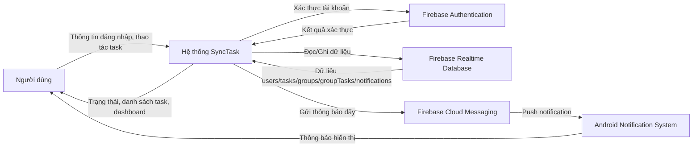
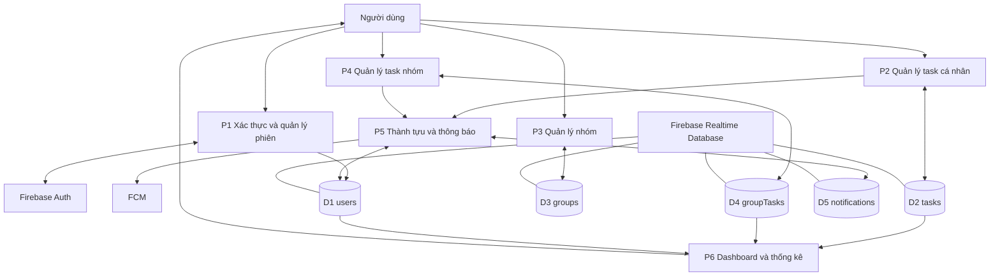
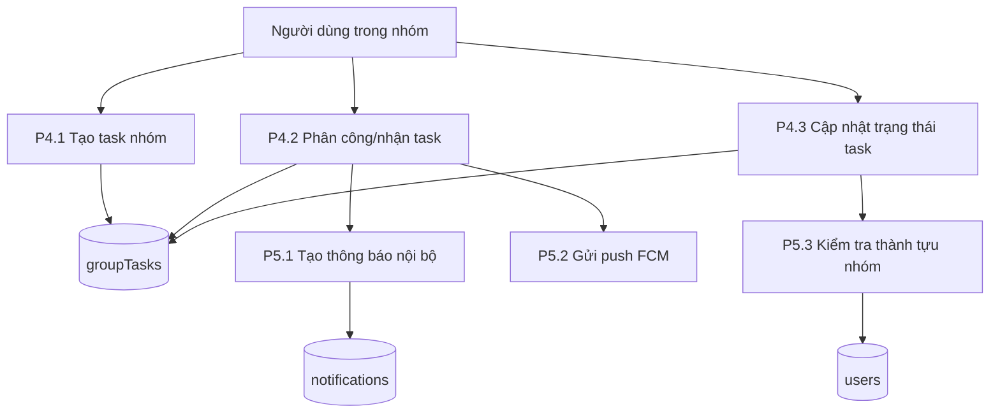

# Luồng hoạt động và DFD hệ thống SyncTask

## Mục tiêu tài liệu

Tài liệu mô tả chi tiết luồng xử lý nghiệp vụ dưới góc nhìn dữ liệu, phục vụ báo cáo đồ án và pha phân tích hệ thống.

## Luồng hoạt động chính

## Luồng đăng nhập và khởi tạo phiên làm việc

1. Người dùng nhập thông tin đăng nhập.
2. `AuthViewModel` xác thực qua Firebase Authentication.
3. `MainActivity` kiểm tra:
   - Phiên đăng nhập có hợp lệ hay không.
   - Email đã được xác thực hay chưa.
   - Người dùng có thuộc lần sử dụng đầu tiên hay không.
4. Điều hướng đến `login`, `welcome` hoặc `main`.

## Luồng tạo và quản lý task cá nhân

1. Người dùng tạo task tại `AddTaskBottomSheet`.
2. `HomeViewModel` gọi `FirebaseHomeTaskRepository` để ghi dữ liệu vào `/tasks/{uid}`.
3. Listener realtime đồng bộ lại danh sách task trong `HomeUiState`.
4. Khi người dùng hoàn thành task:
   - Hệ thống cập nhật `isCompleted`.
   - Đánh giá đúng hạn hoặc trễ hạn.
   - Ghi thông báo nội bộ vào `/notifications/{uid}`.
   - Kiểm tra điều kiện mở khóa thành tựu cá nhân.

## Luồng quản lý nhóm và task nhóm

1. Tạo nhóm: sinh record mới trong `/groups`, gán `ownerId`, tạo `inviteCode`.
2. Tham gia nhóm: tra cứu `inviteCode`, dùng transaction thêm `uid` vào `members`.
3. Tạo task nhóm: ghi vào `/groupTasks/{groupId}/{taskId}`.
4. Phân công task:
   - Cập nhật `assignedToId`.
   - Tạo thông báo nội bộ cho người nhận.
   - Nếu có FCM token thì gửi push notification.
5. Hoàn thành task nhóm:
   - Đảo trạng thái `isCompleted`.
   - Cập nhật `groupTaskCount` tại hồ sơ người dùng.
   - Kiểm tra thành tựu nhóm và phát dialog thành tựu.

## Tương tác giữa cụm Cá nhân và cụm Nhóm

1. Cùng chia sẻ hồ sơ người dùng trong node `/users/{uid}`.
2. Cùng ghi nhận thành tựu tại `unlockedAchievements`.
3. Cùng đẩy dữ liệu sang module Dashboard để tổng hợp hiệu suất.
4. Cùng dùng module Notification để phản hồi sự kiện nghiệp vụ.

## DFD mức ngữ cảnh (Context Diagram)

## DFD mức 1

## DFD mức 2 cho P4 (Quản lý task nhóm)

## Ma trận đối tượng DFD

| Thành phần | Vai trò |
|---|---|
| External Entity | Người dùng, Firebase Auth, FCM, Android OS |
| Process | Xác thực, quản lý task cá nhân, quản lý nhóm, quản lý task nhóm, thông báo, dashboard |
| Data Store | users, tasks, groups, groupTasks, notifications |
| Data Flow | Đăng nhập, tạo task, phân công, cập nhật trạng thái, thông báo, thống kê |

## Nhận xét kỹ thuật

- Dữ liệu dùng listener realtime nên UI cập nhật gần như ngay lập tức.
- Các nghiệp vụ có transaction (join group, toggle status, count delta) giúp đảm bảo nhất quán.
- Luồng thông báo được tách thành thông báo nội bộ và thông báo đẩy để tăng khả năng mở rộng.
