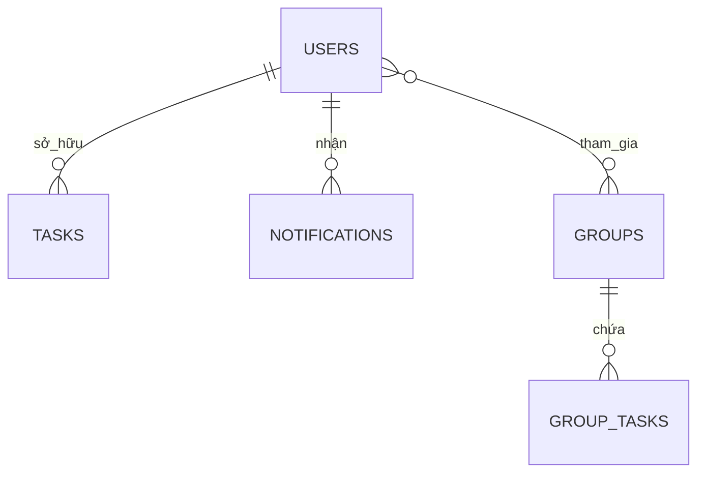

# Thiết kế cơ sở dữ liệu SyncTask

## Tổng quan lưu trữ

Hệ thống sử dụng song song 3 lớp dữ liệu:

1. **Firebase Realtime Database**: nguồn dữ liệu nghiệp vụ chính, đồng bộ thời gian thực.
2. **DataStore Preferences**: lưu cài đặt và cờ điều hướng.
3. **Room SQLite**: lưu dữ liệu local phục vụ một số trường hợp hỗ trợ.

## Thiết kế dữ liệu theo code

## Node `users`

- Được ghi ở các vị trí:
  - `AuthViewModel.saveUserToDatabase()`
  - `GroupTaskViewModel.updateGroupTaskCount()`
  - `HomeViewModel.unlockAchievement()` và `GroupTaskViewModel.unlockAchievement()`
  - `SyncTaskMessagingService.onNewToken()`
- Ý nghĩa:
  - Hồ sơ người dùng mở rộng ngoài Firebase Auth.
  - Lưu `displayName`, `unlockedAchievements`, `groupTaskCount`, `fcmToken`.

## Node `tasks`

- Truy cập chính qua `FirebaseHomeTaskRepository`.
- Cơ chế đọc:
  - `observeTasks(uid, onTasks, onError)` đăng ký `ValueEventListener`.
  - Khi `onDataChange`, dữ liệu được map về `FirebaseTask`, gán lại `task.id = child.key`.
  - Sắp xếp `sortByDescending { it.timestamp }` trước khi đẩy lên UI.
- Cơ chế ghi:
  - `addTask`: `push()` sinh `taskId`, sau đó `setValue(task.copy(id = taskId))`.
  - `updateTaskCompleted`: chỉ cập nhật trường `isCompleted`.

## Node `groups`

- Truy cập chính qua `FirebaseGroupRepository`.
- `createGroup`:
  - Tạo `groupId` bằng `push().key`.
  - Sinh `inviteCode` 6 ký tự chữ hoa + số.
  - Khởi tạo `members = listOf(ownerUid)`.
- `joinGroup`:
  - Truy vấn theo `orderByChild("inviteCode").equalTo(inviteCode)`.
  - Dùng `runTransaction` trên nhánh `members` để chống race condition.
  - Nếu `uid` đã tồn tại trong mảng thì `Transaction.abort()`.

## Node `groupTasks`

- Truy cập chính qua `FirebaseGroupTaskRepository`.
- `observeGroupTasks`:
  - Đọc toàn bộ task theo `groupId`.
  - Gán lại `id` và `groupId` từ key/path để tránh lệch dữ liệu.
  - Sắp xếp giảm dần theo `timestamp`.
- `toggleTaskStatus`:
  - Chạy transaction trực tiếp trên `isCompleted`.
  - Trả về `delta`:
    - `+1` nếu từ chưa hoàn thành -> hoàn thành.
    - `-1` nếu ngược lại.
    - `0` nếu transaction không commit.
- `applyGroupTaskCountDelta`:
  - Transaction trên `/users/{uid}/groupTaskCount`.
  - Dùng `coerceAtLeast(0)` để chống âm số.

## Node `notifications`

- Truy cập chính qua `FirebaseNotificationRepository`.
- `addNotification`:
  - Sinh id bằng `push()`.
  - Ghi `timestamp = System.currentTimeMillis()`, `isRead = false`.
- `observeNotifications`:
  - Đồng bộ danh sách theo thời gian thực.
  - Sắp xếp mới nhất lên đầu để hiển thị thuận mắt.

## Bảng dữ liệu logic

| Node | Khóa chính | Hàm ghi chính | Hàm đọc chính | Đặc điểm code |
|---|---|---|---|---|
| users | `uid` | `saveUserToDatabase`, `saveUnlockedAchievements`, `onNewToken` | `loadUserProfile` | Dữ liệu hồ sơ + thành tựu + token |
| tasks | `uid/taskId` | `addTask`, `updateTaskCompleted`, `deleteTask` | `observeTasks` | Realtime, sort theo timestamp |
| groups | `groupId` | `createGroup`, `joinGroup`, `leaveGroup` | `observeUserGroups`, `observeGroupInfo` | Dùng transaction cho members |
| groupTasks | `groupId/taskId` | `addGroupTask`, `setTaskAssignee`, `toggleTaskStatus` | `observeGroupTasks` | Dùng transaction cho trạng thái |
| notifications | `uid/notificationId` | `addNotification`, `markAsRead` | `observeNotifications` | Có cờ `isRead` |

## Sơ đồ ER ở mức nghiệp vụ

## Thiết kế Room trong code hiện tại

Entity local `Task` và `TaskDao` nằm trong:

- `model/Task.kt`
- `data/TaskDao.kt`
- `data/AppDatabase.kt`

Một số điểm kỹ thuật:

1. `AppDatabase` dùng Singleton + Double Checked Locking.
2. Đang bật `allowMainThreadQueries()`:
   - Thuận tiện demo.
   - Không phù hợp production vì có thể block UI thread.
3. `fallbackToDestructiveMigration()`:
   - Tránh crash khi đổi schema nhanh.
   - Đánh đổi bằng việc mất dữ liệu local khi tăng version không có migration.

## DataStore theo code

| ViewModel | Mục đích | Key chính |
|---|---|---|
| `OnboardingViewModel` | Đánh dấu đã qua tutorial | `is_first_time` |
| `ThemeViewModel` | Chuyển sáng/tối | `is_dark_theme` |
| `SoundSettingsViewModel` | Bật/tắt âm thanh, âm lượng | `is_enabled`, `volume_percent` |

## Ràng buộc nhất quán dữ liệu

1. Dùng transaction cho thao tác có cạnh tranh ghi.
2. Tách node theo miền nghiệp vụ để giảm coupling.
3. Không trộn thông tin profile vào task để tránh lặp dữ liệu.
4. Chấp nhận eventual consistency cho luồng notification/push.
