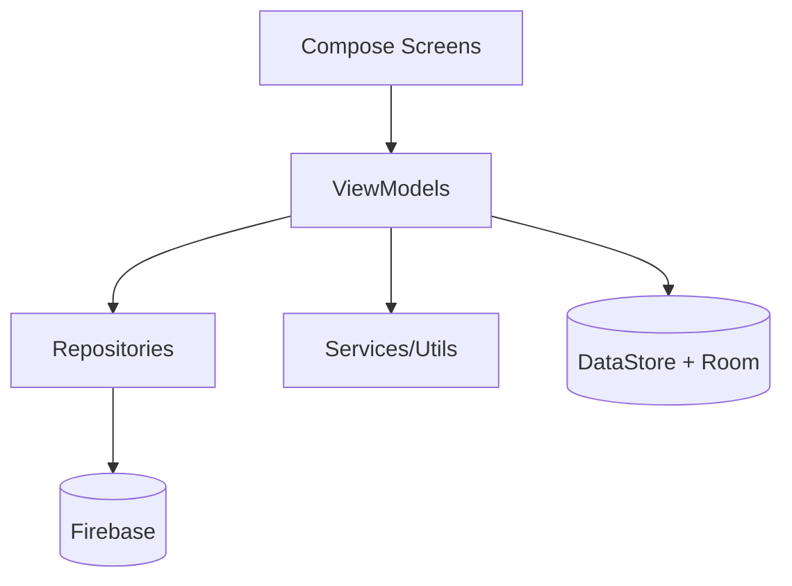
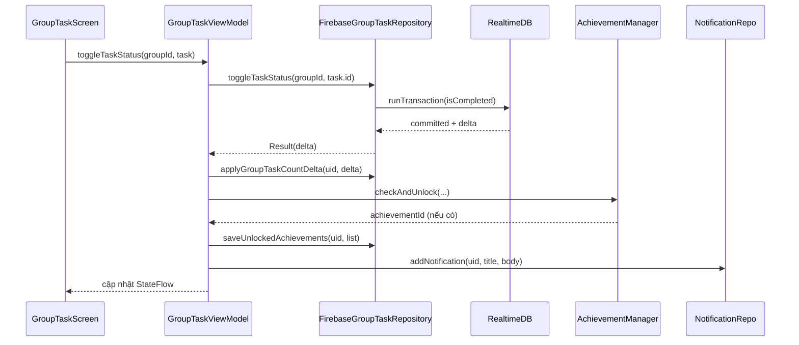

# Thiết kế hệ thống ứng dụng SyncTask

## Mục tiêu kiến trúc

Thiết kế hệ thống hướng tới:

- Tách biệt rõ UI, nghiệp vụ và dữ liệu.
- Ưu tiên đồng bộ trạng thái theo thời gian thực.
- Tăng khả năng mở rộng từng module độc lập.
- Đảm bảo code dễ truy vết, dễ bảo trì ở cấp độ lớp/hàm.

## Kiến trúc lớp theo code thực tế

## Phân tích chi tiết theo module code

## Module xác thực

| Thành phần | Trách nhiệm | Hàm quan trọng |
|---|---|---|
| `AuthViewModel` | Validate input, gọi Firebase Auth, map lỗi nghiệp vụ | `loginWithEmail`, `registerWithEmail`, `sendPasswordResetEmail`, `mapAuthError` |
| `MainActivity` | Quyết định `startDestination` theo phiên đăng nhập + onboarding | block `computedStartRoute` trong `LaunchedEffect` |

Điểm chuyên sâu:

1. Luồng login kiểm tra provider `password` và bắt buộc `isEmailVerified`.
2. Luồng register cập nhật `displayName` vào Auth profile trước khi ghi vào `/users/{uid}`.
3. Error mapping không trả raw exception mà chuyển sang message thân thiện.

## Module task cá nhân

| Thành phần | Trách nhiệm | Hàm quan trọng |
|---|---|---|
| `HomeViewModel` | Quản lý `HomeUiState`, task stream, thành tựu cá nhân | `listenToTasks`, `addTask`, `toggleTaskStatus`, `unlockAchievement` |
| `FirebaseHomeTaskRepository` | Đọc/ghi `/tasks/{uid}` và hồ sơ thành tựu | `observeTasks`, `addTask`, `updateTaskCompleted`, `saveUnlockedAchievements` |

Điểm chuyên sâu:

1. `listenToTasks` lưu callback huỷ listener để tránh leak.
2. Khi toggle hoàn thành task:
   - Phân nhánh đúng hạn/trễ hạn.
   - Gửi âm thanh sự kiện tương ứng.
   - Ghi thông báo nội bộ.
   - Check thành tựu bằng `AchievementManager`.

## Module nhóm và task nhóm

| Thành phần | Trách nhiệm | Hàm quan trọng |
|---|---|---|
| `GroupViewModel` | Tạo nhóm, tham gia nhóm, theo dõi danh sách nhóm | `createGroup`, `joinGroup`, `fetchUserGroups` |
| `GroupTaskViewModel` | Quản lý task trong nhóm, phân công, thành tựu nhóm | `addGroupTask`, `assignTask`, `toggleTaskStatus`, `leaveOrDeleteGroup` |
| `FirebaseGroupRepository` | Thao tác node `/groups` | `observeUserGroups`, `createGroup`, `joinGroup` |
| `FirebaseGroupTaskRepository` | Thao tác node `/groupTasks` và một phần `/users` | `observeGroupTasks`, `setTaskAssignee`, `toggleTaskStatus`, `applyGroupTaskCountDelta` |

Điểm chuyên sâu:

1. `joinGroup` dùng transaction để tránh thêm thành viên trùng.
2. `toggleTaskStatus` ở task nhóm trả `delta` giúp đồng bộ biến đếm nhóm.
3. `leaveOrDeleteGroup` phân quyền mềm theo `ownerId` ngay tại ViewModel.

## Module thông báo

| Thành phần | Trách nhiệm | Hàm quan trọng |
|---|---|---|
| `NotificationViewModel` | Stream thông báo realtime, đếm unread, đánh dấu đã đọc | `listenToNotifications`, `markAsRead`, `markAllAsRead` |
| `FirebaseNotificationRepository` | CRUD notification trên Realtime DB | `observeNotifications`, `addNotification`, `markAsRead` |
| `SyncTaskMessagingService` | Nhận FCM và hiển thị notification hệ điều hành | `onNewToken`, `onMessageReceived`, `showNotification` |
| `NotificationHelper` | Gửi push theo HTTP v1 (mức demo) | `sendPushNotification` |

Điểm chuyên sâu:

1. `NotificationViewModel` có `appStartTime` để tránh phát âm thanh cho dữ liệu cũ.
2. `SyncTaskMessagingService.onNewToken` tự đồng bộ token vào `/users/{uid}/fcmToken`.
3. `NotificationHelper` có guard:
   - Nếu chưa cấu hình `PROJECT_ID` hoặc token OAuth2 rỗng thì bỏ qua gửi.

## Sequence chuyên sâu: hoàn thành task nhóm

## Đánh giá chất lượng thiết kế hiện tại

| Tiêu chí | Đánh giá |
|---|---|
| SoC | Tốt, do tách rõ Screen/ViewModel/Repository |
| Transaction safety | Tốt ở các điểm nhạy cảm (`members`, `isCompleted`, `groupTaskCount`) |
| Khả năng test | Khá, nhưng còn phụ thuộc trực tiếp Firebase singleton trong nhiều lớp |
| Khả năng mở rộng | Tốt ở tầng UI và ViewModel; trung bình ở tầng push do `NotificationHelper` còn client-side |

## Hướng tối ưu chuyên sâu theo code

1. Inject `FirebaseAuth/FirebaseDatabase` qua constructor thay vì gọi `getInstance()` trực tiếp để tăng testability.
2. Chuyển gửi push sang backend service để loại bỏ OAuth token khỏi client.
3. Chuẩn hóa sealed result cho tất cả repository để map lỗi thống nhất.
4. Bổ sung unit test cho `AchievementManager`, `AuthViewModel.mapAuthError`, `GroupTaskViewModel.toggleTaskStatus`.
