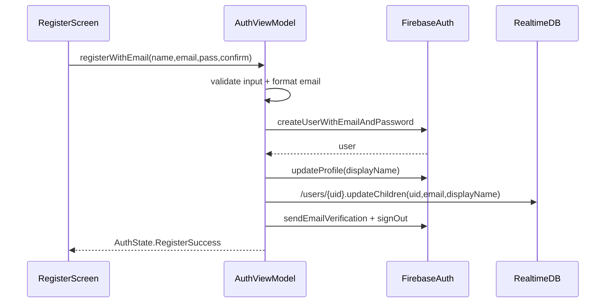
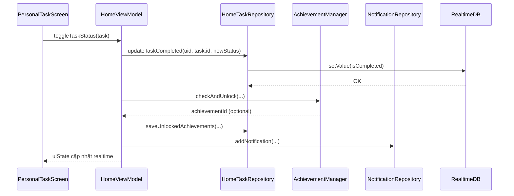
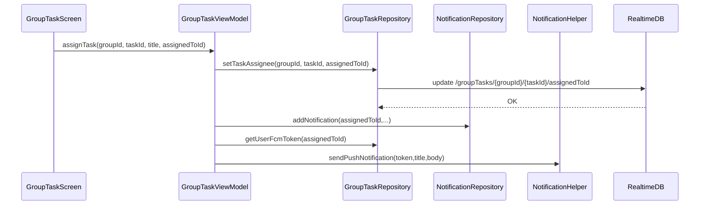

# Ứng dụng làm gì và làm như thế nào

## Bài toán được giải quyết

Ứng dụng xử lý đồng thời hai lớp bài toán:

1. **Bài toán cá nhân**: quản lý task theo mức ưu tiên và deadline.
2. **Bài toán cộng tác nhóm**: phân công, nhận việc, theo dõi hoàn thành và nhắc việc theo thời gian thực.

## Ứng dụng làm gì ở mức nghiệp vụ

| Miền nghiệp vụ | Chức năng cốt lõi | Thành phần code chính |
|---|---|---|
| Xác thực | Đăng ký/đăng nhập/xác thực email/quên mật khẩu | `AuthViewModel`, `MainActivity` |
| Cá nhân | Tạo task, toggle hoàn thành, theo dõi deadline | `HomeViewModel`, `FirebaseHomeTaskRepository` |
| Nhóm | Tạo nhóm, tham gia mã mời, phân công task | `GroupViewModel`, `GroupTaskViewModel` |
| Thông báo | In-app notification + push notification | `NotificationViewModel`, `FirebaseNotificationRepository`, `SyncTaskMessagingService` |
| Gamification | Thành tựu cá nhân và nhóm | `AchievementManager`, `HomeViewModel`, `GroupTaskViewModel` |
| Hiển thị tổng hợp | Dashboard và điều hướng tab | `MainScreen`, `DashboardScreen` |

## Ứng dụng làm như thế nào ở mức code

## Mẫu xử lý chung của một use case

1. Screen phát sinh sự kiện người dùng.
2. ViewModel validate và điều phối nghiệp vụ.
3. Repository thao tác Firebase.
4. Listener realtime trả dữ liệu về ViewModel.
5. StateFlow thay đổi, Compose render lại.

## Luồng chuyên sâu: đăng ký tài khoản

## Luồng chuyên sâu: hoàn thành task cá nhân

## Luồng chuyên sâu: phân công task nhóm

## Tương tác Cá nhân - Nhóm - Thông báo

| Tương tác | Cách triển khai trong code | Kết quả |
|---|---|---|
| Cá nhân hoàn thành task | `HomeViewModel.toggleTaskStatus` | Cập nhật task + thông báo + thành tựu |
| Nhóm hoàn thành task | `GroupTaskViewModel.toggleTaskStatus` | Cập nhật trạng thái + `groupTaskCount` + thành tựu nhóm |
| Nhóm phân công task | `GroupTaskViewModel.assignTask` | Ghi `assignedToId` + in-app + push |
| Notification realtime | `NotificationViewModel.listenToNotifications` | Tự cập nhật badge chưa đọc |

## Điểm mạnh kỹ thuật trong code hiện tại

1. Dùng `MutableStateFlow` nhất quán cho state UI.
2. Dùng transaction ở điểm dữ liệu cạnh tranh ghi.
3. Phần `AchievementManager` là pure object, thuận lợi unit test.
4. Điều hướng khởi tạo ở `MainActivity` tránh reset NavHost liên tục.

## Hạn chế kỹ thuật cần lưu ý

1. Nhiều lớp gọi trực tiếp `FirebaseAuth.getInstance()` và `FirebaseDatabase.getInstance()`, khó mock khi test.
2. `NotificationHelper` gửi FCM từ client chỉ phù hợp demo, chưa chuẩn production.
3. Room đang bật `allowMainThreadQueries()`, có rủi ro block UI trong tình huống tải nặng.

## Đề xuất nâng cấp chuyên sâu theo code

1. Đưa Firebase dependency vào DI container (Hilt/Koin) để tăng khả năng test.
2. Chuyển luồng gửi push qua backend function để bảo mật OAuth.
3. Bổ sung test case:
   - `AuthViewModel.mapAuthError`
   - `HomeViewModel.toggleTaskStatus`
   - `GroupTaskViewModel.toggleTaskStatus`
   - `AchievementManager.checkAndUnlock`
