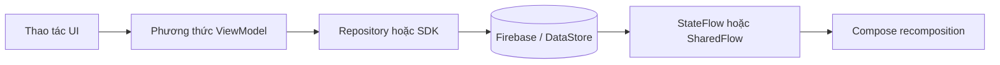

# SyncTask Micro Features Breakdown (Cực Chi Tiết)

## 1. Mục tiêu tài liệu

Tài liệu này trả lời trực tiếp ba câu hỏi kỹ thuật cho từng chức năng nhỏ trong ứng dụng:

- **Là gì**: hành vi cụ thể mà người dùng hoặc hệ thống kích hoạt.
- **Nằm ở đâu**: tệp Kotlin/Compose và lớp trách nhiệm chính (UI, ViewModel, Repository, Utility).
- **Chạy như thế nào**: chuỗi xử lý từ thao tác giao diện đến cập nhật trạng thái và tương tác Firebase hoặc lưu trữ cục bộ.

Phạm vi bám sát mã nguồn hiện tại trong module `app`. Đường dẫn tệp ghi tương đối so với thư mục gốc dự án Android.

## 2. Khung mô tả và ký hiệu dùng xuyên suốt

### 2.1. Ba lớp trình bày cho mỗi cụm

1. **Danh sách micro-feature**: hành vi có thể kiểm thử độc lập hoặc gần độc lập.
2. **Luồng hoạt động**: bước kích hoạt, xử lý, cập nhật state, phản hồi UI hoặc hệ thống.
3. **Bảng ánh xạ mã nguồn**: neo trách nhiệm vào tệp/hàm/flow cụ thể.

### 2.2. Sơ đồ tổng quát một đường đi micro-feature

### 2.3. Các loại luồng dữ liệu thường gặp

| Ký hiệu trong tài liệu | Ý nghĩa |
|---|---|
| `StateFlow` | Trạng thái màn hình hoặc danh sách dữ liệu; UI `collectAsState()`. |
| `SharedFlow` | Sự kiện một lần (ví dụ âm thanh), không giữ trạng thái cuối bắt buộc. |
| Listener Firebase | `ValueEventListener` hoặc callback repository; hủy qua hàm `() -> Unit` trả về khi đăng ký. |

## 3. Auth micro-features

### 3.1. Danh sách micro-feature

| Micro-feature | Mô tả kỹ thuật | Neo mã |
|---|---|---|
| Login validation | `trim` email/mật khẩu; chặn rỗng; `Patterns.EMAIL_ADDRESS` cho email. | `loginWithEmail` |
| Đăng nhập Firebase | `signInWithEmailAndPassword`; lỗi map qua `mapAuthError`. | `loginWithEmail` |
| Email verification gate | Nếu provider có `password` và `!user.isEmailVerified`: `sendEmailVerification()`, `signOut()`, `Error` với thông báo hướng dẫn; không emit `Success`. | `loginWithEmail` |
| Register validation | Họ tên không rỗng; email/mật khẩu không rỗng; email hợp lệ; mật khẩu `length >= 6`; khớp xác nhận. | `registerWithEmail` |
| Cập nhật hồ sơ Auth | `UserProfileChangeRequest` đặt `displayName`. | `registerWithEmail` |
| Ghi user lên RTDB | `users/{uid}` với `uid`, `email`, `displayName` (nếu có). | `saveUserToDatabase` |
| Sau đăng ký | `sendEmailVerification()`, `signOut()`, `RegisterSuccess`. | `registerWithEmail` |
| Reset password | Validate email; `sendPasswordResetEmail`; `PasswordResetSent` hoặc `mapPasswordResetError`. | `sendPasswordResetEmail` |
| Reset state | `_authState.value = Idle` để tránh snackbar/lặp xử lý. | `resetState` |
| UI đăng nhập | `LaunchedEffect(authState)`: Success → âm thanh + `onLoginSuccess`; Error → âm lỗi + snackbar + `resetState`; PasswordResetSent → snackbar, đóng dialog quên mật khẩu nếu đang gửi. | `LoginScreen` |
| UI đăng ký | `RegisterSuccess` → Toast + `resetState` + `onNavigateToLogin`; Error → snackbar + `resetState`; sửa ô nhập có thể gọi `resetState` khi đang `Error`. | `RegisterScreen` |

### 3.2. Máy trạng thái `AuthState`

| Giá trị sealed class | Ý nghĩa đối với UI |
|---|---|
| `Idle` | Sẵn sàng; không loading. |
| `Loading` | Đang gọi Firebase. |
| `Success` | Đăng nhập thành công (đã qua cổng verify nếu cần). |
| `RegisterSuccess(message)` | Đăng ký xong, cần xác thực email. |
| `PasswordResetSent(message)` | Đã gửi mail đặt lại mật khẩu. |
| `Error(message)` | Thất bại hoặc bị chặn (verify, mạng, sai mật khẩu, v.v.). |

### 3.3. Luồng hoạt động (Auth) — từng bước

1. Người dùng nhập và bấm nút trên `LoginScreen` / `RegisterScreen`.
2. Composable gọi `AuthViewModel.loginWithEmail` / `registerWithEmail` / `sendPasswordResetEmail`.
3. Validate đồng bộ: thất bại thì gán `Error` hoặc `PasswordResetSent` và dừng (không gọi mạng).
4. Hợp lệ: `_authState = Loading`, sau đó listener Firebase hoàn tất.
5. UI `collectAsState`; `LaunchedEffect` theo dõi thay đổi, phát `AppSoundPlayer`, hiển thị snackbar/Toast, điều hướng, gọi `resetState` khi cần tránh lặp.

### 3.4. Bảng vị trí mã nguồn (Auth)

| Vai trò | Đường dẫn tệp |
|---|---|
| Trạng thái và nghiệp vụ Auth | `app/src/main/java/com/phuc/synctask/viewmodel/AuthViewModel.kt` |
| Giao diện đăng nhập | `app/src/main/java/com/phuc/synctask/ui/auth/LoginScreen.kt` |
| Giao diện đăng ký | `app/src/main/java/com/phuc/synctask/ui/auth/RegisterScreen.kt` |

## 4. Main shell micro-features

### 4.1. Danh sách micro-feature

| Micro-feature | Chi tiết theo mã |
|---|---|
| Top bar chào hỏi | `displayName` nếu không rỗng; không thì phần trước `@` của email; fallback `"Bạn"`. |
| Initials avatar | `getInitials(name)`: không từ → `"?"`; một từ → chữ cái đầu; nhiều từ → chữ đầu tên + chữ đầu họ (từ cuối). |
| Tutorial lại | Nút sách: `tutorialStep = 0`, phát âm thanh `NOTIFICATION`. |
| Spotlight overlay | `SpotlightOverlay` với `TUTORIAL_STEPS`; bước 0–3 neo `Rect` từ `onGloballyPositioned` của từng tab bottom bar. |
| Thông báo in-app | `showNotificationSheet = true`; `NotificationBottomSheet` + `NotificationViewModel`. |
| Badge unread | `BadgedBox` khi `unreadCount > 0` từ `notificationViewModel.unreadCount`. |
| Dialog âm thanh | `AlertDialog`: `Switch` `setEnabled`, `Slider` `setVolumePercent`; slider chỉ bật khi `isEnabled`. |
| Toggle theme | `themeViewModel.toggleTheme()`; icon `WbSunny` / `NightsStay` theo `isDark`. |
| Đăng xuất | `onLogout()` callback ra ngoài graph điều hướng. |
| FAB thêm task | Chỉ khi `currentRoute == Screen.Personal.route`; mở `AddTaskBottomSheet`. |
| Bottom navigation | `popUpTo(findStartDestination) { saveState = true }`, `launchSingleTop`, `restoreState = true`. |
| Ẩn top/bottom trên detail | `isDetailRoute`: route `quadrant_detail/{quadrant}` hoặc `group_detail/{groupId}`. |
| Âm thanh từ Home | `LaunchedEffect(Unit) { homeViewModel.soundEvent.collectLatest { AppSoundPlayer.play(it) } }`. |

### 4.2. Luồng hoạt động (Main shell)

1. `MainScreen` khởi tạo `NavHost` với `startDestination = Personal`.
2. Các ViewModel scoped: `HomeViewModel`, `NotificationViewModel`, `SoundSettingsViewModel`; `ThemeViewModel` truyền từ ngoài vào.
3. Thao tác trên top bar chỉnh state cục bộ (sheet/dialog) hoặc ViewModel (theme, sound).
4. FAB chỉ trên tab Personal: mở sheet → `homeViewModel.addTask` khi lưu (xem mục 5).
5. Chuyển tab: `navigate` với lưu/khôi phục state back stack để giữ trạng thái màn hình con.

### 4.3. Bảng tuyến đường `NavHost` chính

| Route | Màn hình / composable |
|---|---|
| `Screen.Personal.route` | `PersonalTaskScreen` + callback vào `quadrant_detail/{quadrant}`. |
| `Screen.Group.route` | `GroupListScreen` → `group_detail/{groupId}`. |
| `Screen.Dashboard.route` | `DashboardScreen`. |
| `Screen.Achievement.route` | `AchievementScreen`. |
| `quadrant_detail/{quadrant}` | `QuadrantDetailScreen` với `Quadrant.valueOf`. |
| `group_detail/{groupId}` | `GroupTaskScreen`. |

### 4.4. Bảng vị trí mã nguồn (Main shell)

| Vai trò | Đường dẫn tệp |
|---|---|
| Khung Scaffold, điều hướng, FAB, tutorial | `app/src/main/java/com/phuc/synctask/ui/main/MainScreen.kt` |
| Bước tutorial và overlay | `app/src/main/java/com/phuc/synctask/ui/onboarding/` (ví dụ `SpotlightOverlay`, `TUTORIAL_STEPS`) |

## 5. Personal task micro-features (Firebase cá nhân)

### 5.1. Nguồn dữ liệu và repository

Luồng task cá nhân trong `HomeViewModel` dùng **`FirebaseHomeTaskRepository`**, không dùng Room tại ViewModel này.

| Đường dẫn RTDB | Ý nghĩa |
|---|---|
| `tasks/{uid}/{taskId}` | Danh sách task cá nhân; `push()` sinh `taskId`. |
| `users/{uid}` | Hồ sơ người dùng, gồm `unlockedAchievements` (và các trường khác theo model). |

### 5.2. Danh sách micro-feature (ViewModel + repository)

| Micro-feature | Hành vi | API chính |
|---|---|---|
| Lắng nghe danh sách | `ValueEventListener` trên `tasks/{uid}`; sort `timestamp` giảm dần; hủy listener khi `onCleared`. | `listenToTasks`, `observeTasks` |
| Trạng thái UI tổng | `Loading` / `Success(tasks)` / `Empty` / `Error`. | `_uiState`, `HomeUiState` |
| Đếm đã hoàn thành | `completedTasksCount` từ `tasks.count { isCompleted }`. | `StateFlow` derived |
| Đếm hạn hôm nay | So khớp `YEAR` và `DAY_OF_YEAR` của `dueDate`. | `todayTasksCount` |
| Đếm quá hạn | Chưa hoàn thành, có `dueDate`, `dueDate < startOfTodayMillis`. | `overdueTasksCount` |
| Thêm task | Tạo `FirebaseTask` với `timestamp`, `creatorId`, `dueDate`; `addTask`; thành công → âm thanh `TASK_CREATED` + thông báo in-app khởi tạo. | `addTask` |
| Xóa task | `deleteTask` repository. | `deleteTask` |
| Khôi phục task | `setValue(task)` về đúng `task.id`. | `restoreTask` |
| Toggle hoàn thành | `updateTaskCompleted`; khi chuyển sang hoàn thành: thông báo đúng hạn/trễ hạn, âm thanh tương ứng, gọi `AchievementManager.checkAndUnlock` với `completedCount` ước lượng sau toggle. | `toggleTaskStatus` |
| Mở khóa thành tựu | Cập nhật `userProfile` cục bộ, `saveUnlockedAchievements`, thông báo in-app, `_achievementUnlocked = achievementId`. | `unlockAchievement` |
| Đóng dialog thành tựu | Gán `_achievementUnlocked = null`. | `dismissAchievementDialog` |
| Phát âm thanh nghiệp vụ | `soundEvent` SharedFlow; MainScreen thu và `AppSoundPlayer.play`. | `_soundEvent.tryEmit` |

### 5.3. Luồng hoạt động (thêm task cá nhân)

1. Người dùng bấm FAB trên tab Personal → `showAddSheet = true`.
2. `AddTaskBottomSheet` nhập title, description, urgent/important, dueDate.
3. `onSave` gọi `homeViewModel.addTask(...)`, đóng sheet.
4. `viewModelScope.launch`: `repository.addTask` → RTDB.
5. Thành công: phát `TASK_CREATED`, `FirebaseNotificationRepository.addNotification` cho chính user.
6. Listener `observeTasks` nhận snapshot mới → `_tasks` → UI cập nhật ma trận/danh sách.

### 5.4. Luồng hoạt động (toggle hoàn thành + thành tựu)

1. UI gọi `toggleTaskStatus(task)`.
2. Repository cập nhật `isCompleted` trên node task.
3. Nếu vừa đánh dấu hoàn thành: tính `isOnTime` so với `dueDate`; gửi thông báo + âm thanh.
4. Đếm `completedCount` (công thức trong mã cộng thêm 1 nếu task trước đó chưa completed).
5. `AchievementManager.checkAndUnlock(..., isGroupTask = false)` → callback `unlockAchievement`.
6. `_achievementUnlocked` hiển thị dialog (thường từ `HomeScreen` hoặc layer cha đang collect flow này).

### 5.5. `WorkloadChecker` và Room

| Ghi chú | Nội dung |
|---|---|
| Vai trò thiết kế | `WorkloadChecker` kiểm tra tổng `effort` theo ngày qua `TaskDao` (Room), ngưỡng `EFFORT_THRESHOLD = 7`, hiển thị Toast cảnh báo. |
| Trạng thái tích hợp | Tại thời điểm rà soát mã nguồn, **không có** tham chiếu nào khác tới `WorkloadChecker` ngoài định nghĩa lớp; luồng task cá nhân chính trong app đi qua **Firebase** (`HomeViewModel`). Khi viết báo cáo, nên phân biệt rõ “sẵn có cho luồng Room” và “luồng đang chạy trên Firebase”. |

### 5.6. Bảng vị trí mã nguồn (Personal / Home)

| Vai trò | Đường dẫn tệp |
|---|---|
| ViewModel task cá nhân + thành tựu + âm thanh | `app/src/main/java/com/phuc/synctask/viewmodel/HomeViewModel.kt` |
| Repository RTDB task cá nhân | `app/src/main/java/com/phuc/synctask/data/repository/FirebaseHomeTaskRepository.kt` |
| Màn hình ma trận / Eisenhower | `app/src/main/java/com/phuc/synctask/ui/home/HomeScreen.kt` |
| Danh sách / ma trận cá nhân | `app/src/main/java/com/phuc/synctask/ui/personal/PersonalTaskScreen.kt` |
| Chi tiết một ô Eisenhower | `app/src/main/java/com/phuc/synctask/ui/personal/QuadrantDetailScreen.kt` (tham chiếu từ `MainScreen`) |
| Sheet thêm task | `app/src/main/java/com/phuc/synctask/ui/main/AddTaskBottomSheet.kt` |
| Kiểm tra workload (Room, độc lập) | `app/src/main/java/com/phuc/synctask/utils/WorkloadChecker.kt` |

## 6. Group micro-features

### 6.1. Danh sách micro-feature (nhóm + task nhóm)

| Lớp | Micro-feature | Chi tiết |
|---|---|---|
| GroupViewModel | Auth listener | `AuthStateListener`: user null → xóa list + `Error("Chưa đăng nhập!")`; có user → `fetchUserGroups`. |
| GroupViewModel | Quan sát nhóm | `observeUserGroups` → `_groups`, `_uiState` Success/Empty/Error. |
| GroupViewModel | Tạo nhóm | `createGroup`: `inviteCode` trả về, thông báo in-app cho chủ nhóm. |
| GroupViewModel | Tham gia nhóm | `joinGroup(inviteCode.uppercase())` → `Joined` / `AlreadyMember` / `NotFound`; khi join thành công có thông báo cho owner. |
| GroupTaskViewModel | Nạp nhóm | `loadGroup`: tránh load trùng `groupId`; `cleanup`; `loadUserProfile`; lắng nghe group + tasks. |
| GroupTaskViewModel | Loading tối thiểu | Sau khi có task list: chờ thêm `delay` để branded loading tối thiểu ~1500 ms. |
| GroupTaskViewModel | Task nhóm | `addGroupTask`, `claimTask`, `assignTask`, `toggleTaskStatus`, `deleteGroupTask`, `restoreGroupTask`. |
| GroupTaskViewModel | Thông báo assign | `sendNotificationToUser`: in-app + đọc `fcmToken` + `NotificationHelper.sendPushNotification` nếu có token. |
| GroupTaskViewModel | Thành tựu nhóm | `checkAndUnlock(..., isGroupTask = true, isOwner)`; `unlockAchievement` chặn trùng trong session bằng `achievementId in userProfile.unlockedAchievements`. |
| GroupTaskViewModel | Rời / xóa nhóm | Owner: `deleteGroupAndTasks`; member: `leaveGroup`; gọi `onComplete` khi thành công. |

### 6.2. Luồng hoạt động (join nhóm)

1. UI gọi `joinGroup` với mã; ViewModel chuẩn hóa `uppercase()`.
2. Repository xử lý transaction/lookup (chi tiết trong `FirebaseGroupRepository`).
3. Kết quả `JoinGroupStatus`: UI hiển thị thông điệp tương ứng.
4. Nếu `Joined`, thêm thông báo cho `ownerId` qua `FirebaseNotificationRepository`.

### 6.3. Luồng hoạt động (hoàn thành task nhóm + thành tựu)

1. `toggleTaskStatus` gọi repository; nhận `delta` (số lần hoàn thành thay đổi).
2. Nếu `delta == 0` thì return sớm (không xử lý âm thanh/achievement).
3. Nếu `delta > 0`: thông báo đúng hạn/trễ; `updateGroupTaskCount` qua `applyGroupTaskCountDelta`.
4. `AchievementManager.checkAndUnlock` với `completedCount = 0` (đếm nhóm dùng `groupTaskCount` trong profile, logic trong `AchievementManager`).
5. `unlockAchievement` cập nhật profile cục bộ, lưu RTDB, thông báo, set `_achievementUnlocked`.

### 6.4. Bảng vị trí mã nguồn (Group)

| Vai trò | Đường dẫn tệp |
|---|---|
| Danh sách nhóm | `app/src/main/java/com/phuc/synctask/viewmodel/GroupViewModel.kt` |
| Chi tiết nhóm và task nhóm | `app/src/main/java/com/phuc/synctask/viewmodel/GroupTaskViewModel.kt` |
| Repository nhóm | `app/src/main/java/com/phuc/synctask/data/repository/FirebaseGroupRepository.kt` |
| Repository task nhóm | `app/src/main/java/com/phuc/synctask/data/repository/FirebaseGroupTaskRepository.kt` |
| UI danh sách nhóm / task nhóm | `app/src/main/java/com/phuc/synctask/ui/group/` |

## 7. Achievement micro-features

### 7.1. Danh sách quy tắc trong `AchievementManager`

| ID hằng số | Điều kiện mở khóa (theo mã) |
|---|---|
| `ROOKIE_BADGE` | `completedCount >= 1` và chưa có trong `unlocked`. |
| `DILIGENT_BADGE` | `completedCount >= 10`. |
| `WARRIOR_BADGE` | `completedCount >= 50`. |
| `LEGEND_BADGE` | `completedCount >= 200`. |
| `NIGHT_OWL_BADGE` | `Calendar.HOUR_OF_DAY in 1..4` và chưa unlock. (Giao diện mô tả có thể ghi "rạng sáng"; điều kiện thực thi theo khoảng giờ trong code.) |
| `ON_TIME_BADGE` | Có `dueDateMillis` và `System.currentTimeMillis() < dueDateMillis` khi check. |
| `TEAM_PLAYER_BADGE` | `isGroupTask`: `profile.groupTaskCount + 1 >= 5`. |
| `CAPTAIN_BADGE` | `isGroupTask && isOwner`. |

### 7.2. Chống trùng và lưu trữ

- **Cá nhân (`HomeViewModel`)**: sau mỗi unlock, cập nhật `userProfile.unlockedAchievements` ngay trong bộ nhớ rồi mới ghi Firebase; giảm khả năng gọi `onUnlocked` lặp trong cùng phiên nếu logic gọi lại.
- **Nhóm (`GroupTaskViewModel`)**: `unlockAchievement` return sớm nếu `achievementId` đã nằm trong `userProfile.unlockedAchievements`.

### 7.3. Dialog `AchievementUnlockedDialog`

- Nhận `achievementId`, map sang cặp (tên, mô tả) qua `achievementInfo` (song song với `AchievementManager.getAchievementName` cho thông báo).
- Animation scale spring; có thể có hiệu ứng Konfetti (thư viện `konfetti`).
- `onDismiss` để parent gọi `dismissAchievementDialog`.

### 7.4. Bảng vị trí mã nguồn (Achievement)

| Vai trò | Đường dẫn tệp |
|---|---|
| Logic pure kiểm tra điều kiện | `app/src/main/java/com/phuc/synctask/utils/AchievementManager.kt` |
| Dialog | `app/src/main/java/com/phuc/synctask/ui/common/AchievementUnlockedDialog.kt` |
| Màn hình xem thành tựu | `app/src/main/java/com/phuc/synctask/ui/achievement/AchievementScreen.kt` |

## 8. Notification micro-features

### 8.1. Danh sách micro-feature

| Micro-feature | Chi tiết |
|---|---|
| Lắng nghe danh sách | `observeNotifications`; cập nhật `_notifications`. |
| Đếm unread | `unreadCount` = `count { !isRead }` qua `stateIn`. |
| Âm thanh tin mới | So sánh kích thước danh sách và `timestamp > appStartTime` và `!isRead`; tránh spam khi list rỗng ban đầu. |
| Đánh dấu đọc | `markAsRead(uid, notificationId)`. |
| Đọc tất cả | Lọc `!isRead`, gọi `markAsRead` từng id. |
| Lỗi listener | Callback `onError` hiện để trống (ignore) trong ViewModel. |

### 8.2. Luồng hoạt động (FCM)

1. `onNewToken`: nếu đã đăng nhập, ghi `users/{uid}/fcmToken`.
2. `onMessageReceived`: nếu có `message.notification`, dựng `NotificationCompat` kênh `group_task_channel`.
3. Hiển thị trên khay hệ thống (title/body mặc định nếu thiếu).

### 8.3. Bảng vị trí mã nguồn (Notification)

| Vai trò | Đường dẫn tệp |
|---|---|
| ViewModel | `app/src/main/java/com/phuc/synctask/viewmodel/NotificationViewModel.kt` |
| Repository | `app/src/main/java/com/phuc/synctask/data/repository/FirebaseNotificationRepository.kt` |
| FCM service | `app/src/main/java/com/phuc/synctask/service/SyncTaskMessagingService.kt` |
| Bottom sheet UI | `app/src/main/java/com/phuc/synctask/ui/main/NotificationBottomSheet.kt` |

## 9. Dashboard micro-features

### 9.1. Mô hình state chính

Các `MutableStateFlow` công khai (read-only qua `StateFlow`) gồm: `personalCompleted`, `groupCompleted`, `overdueCount`, `eisenhowerStats` (4 phần tử), `weeklyWorkload`, `groupProgress`, `pendingFocusTasks`, `filterType` (`WEEK`/`MONTH`), `isLoading`.

### 9.2. Danh sách micro-feature

| Micro-feature | Ý nghĩa |
|---|---|
| `setFilter` | Chuyển `DashboardFilter.WEEK` hoặc `MONTH` và kích tải lại analytics. |
| Tải dữ liệu | Kết hợp listener/query Firebase (chi tiết trong phần thân `DashboardViewModel`) + `DashboardAnalyticsUseCase` tổng hợp. |
| Eisenhower stats | Bốn nhóm ứng với ma trận; mỗi nhóm `totalCount` và `completedCount`. |
| Focus tasks | Danh sách việc chưa xong ưu tiên hiển thị. |

### 9.3. Luồng hoạt động (Dashboard)

1. Vào tab Dashboard → `DashboardScreen` collect các flow từ `DashboardViewModel`.
2. ViewModel đăng ký nguồn dữ liệu Firebase; khi snapshot đổi, đưa vào `DashboardAnalyticsUseCase`.
3. Kết quả gán vào các `_...` flow; UI biểu đồ và thẻ số cập nhật.
4. Người dùng đổi tuần/tháng → `setFilter` → tính lại chuỗi ngày và aggregate.

### 9.4. Bảng vị trí mã nguồn (Dashboard)

| Vai trò | Đường dẫn tệp |
|---|---|
| ViewModel | `app/src/main/java/com/phuc/synctask/viewmodel/DashboardViewModel.kt` |
| Use case phân tích | `app/src/main/java/com/phuc/synctask/viewmodel/DashboardAnalyticsUseCase.kt` |
| UI | `app/src/main/java/com/phuc/synctask/ui/dashboard/DashboardScreen.kt` |

## 10. Settings micro-features (theme + âm thanh)

### 10.1. Theme (`ThemeViewModel`)

| Micro-feature | Chi tiết |
|---|---|
| DataStore | Tệp preferences tên `theme_prefs`; khóa `DARK_MODE_KEY`. |
| Đọc ban đầu | `init` collect `dataStore.data` → `_isDarkTheme`. |
| Toggle | `toggleTheme` đảo bit trong `dataStore.edit`. |

### 10.2. Âm thanh (`SoundSettingsViewModel`)

| Micro-feature | Chi tiết |
|---|---|
| DataStore | `sound_prefs`; khóa `sound_enabled`, `sound_volume`. |
| State kết hợp | `combine` hai map → `SoundSettingsState(isEnabled, volumePercent)`. |
| `setEnabled` | Ghi boolean. |
| `setVolumePercent` | `coerceIn(0, 100)` trước khi ghi. |

### 10.3. Phát âm thanh ứng dụng

| Thành phần | Vai trò |
|---|---|
| `AppSoundEffects` / `AppSoundPlayer` | Mapping hiệu ứng và phát theo cài đặt âm lượng/bật tắt (xem implementation trong utils). |

### 10.4. Bảng vị trí mã nguồn (Settings)

| Vai trò | Đường dẫn tệp |
|---|---|
| Theme | `app/src/main/java/com/phuc/synctask/viewmodel/ThemeViewModel.kt` |
| Âm thanh | `app/src/main/java/com/phuc/synctask/viewmodel/SoundSettingsViewModel.kt` |
| Player hiệu ứng | `app/src/main/java/com/phuc/synctask/utils/AppSoundPlayer.kt` (và file hiệu ứng liên quan) |

## 11. Tóm tắt cho người không chuyên kỹ thuật

Ứng dụng chia rõ **đăng nhập và tài khoản**, **khung điều hướng chính**, **việc cá nhân trên Firebase**, **việc nhóm với mã mời và phân công**, **thông báo trong app và đẩy hệ thống**, **bảng điều khiển thống kê**, cùng **thành tựu và cài đặt giao diện/âm thanh**. Mỗi thao tác nhỏ đều có thể truy ngược từ màn hình xuống hàm ViewModel và xuống tầng Firebase hoặc DataStore tương ứng, thuận tiện cho kiểm thử và cho báo cáo đồ án.

## 12. Liên hệ với tài liệu song song

| Tài liệu | Nội dung bổ sung |
|---|---|
| `docs/09-Micro-Features-Breakdown.md` | Bản rút gọn song ngữ / đa ngữ trong repo `docs`. |
| `thesis/09_kich_ban_tuong_tac_day_du_trong_app.md` | Kịch bản thao tác end-to-end theo góc nhìn người dùng. |
| `thesis/07_phan_tich_chuyen_sau_theo_code.md` | Phân tích sâu theo lớp và luồng gọi hàm tại một số module. |

Tài liệu này duy trì **độ chi tiết micro-feature**: bảng điều kiện, đường dẫn node Firebase, tên `StateFlow`/`sealed class`, và các nhánh lỗi hoặc early-return quan trọng để đối chiếu trực tiếp với mã nguồn khi đọc hoặc khi viết checklist kiểm thử.
