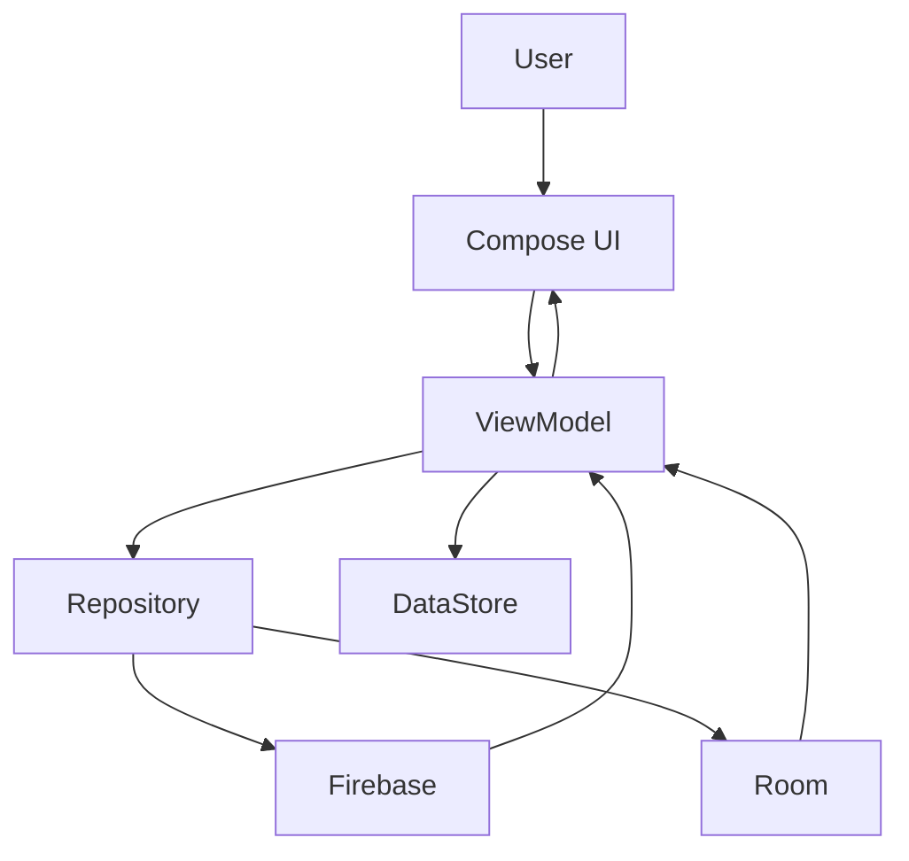

# Architecture and Modules

## Sơ đồ tổng quan

## Tầng UI

Thư mục: app/src/main/java/com/phuc/synctask/ui

- auth: login/register
- onboarding: welcome/tutorial
- personal: ma trận cá nhân
- group: quản lý nhóm
- dashboard: thống kê
- achievement: thành tựu
- main: khung app chính
- common: component dùng chung

## Tầng ViewModel

Thư mục: app/src/main/java/com/phuc/synctask/viewmodel

- AuthViewModel: auth
- HomeViewModel: task cá nhân
- GroupViewModel: danh sách nhóm
- GroupTaskViewModel: task nhóm
- DashboardViewModel: dữ liệu dashboard
- NotificationViewModel: thông báo
- ThemeViewModel/SoundSettingsViewModel/OnboardingViewModel: setting

## Tầng Data

- app/src/main/java/com/phuc/synctask/data
- repository Firebase cho từng nghiệp vụ
- AppDatabase + TaskDao cho local data

## Tầng Model

- FirebaseTask, Task, Group, GroupTask, UserProfile, AppNotification
