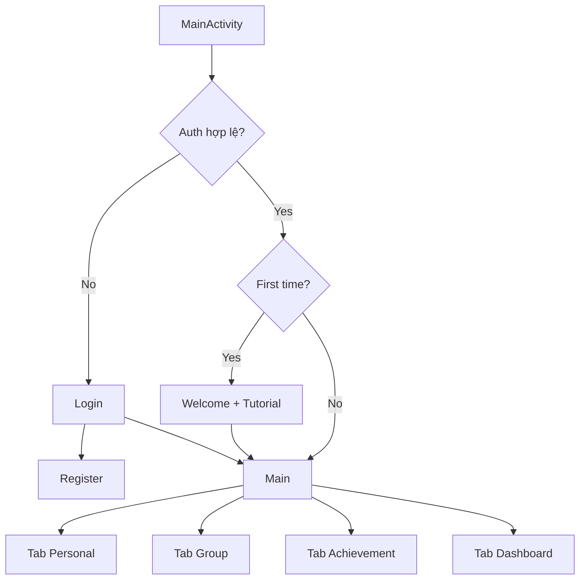

# UI and Navigation

## Route chính

## Màn hình chính

- Personal: xem ma trận Eisenhower.
- Group: xem danh sách nhóm và vào từng nhóm.
- Achievement: xem huy hiệu.
- Dashboard: xem thống kê.

## Thành phần UI nổi bật

- Top bar: user, notification, theme, sound, logout.
- Bottom bar: 4 tab.
- FAB: thêm task cá nhân.
- Bottom sheet: add task, notification list.
- Overlay tutorial: hướng dẫn từng vùng thao tác.
