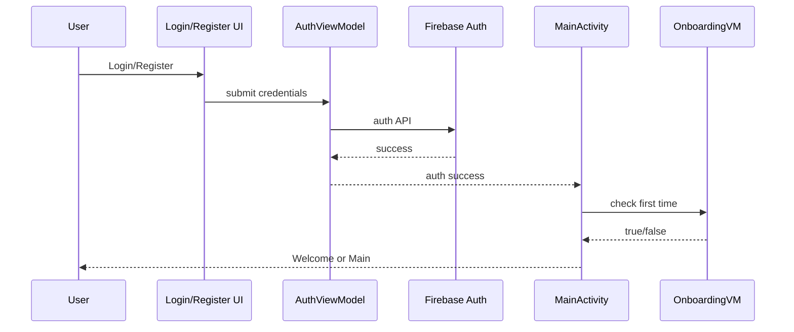
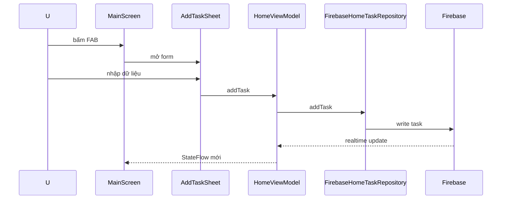
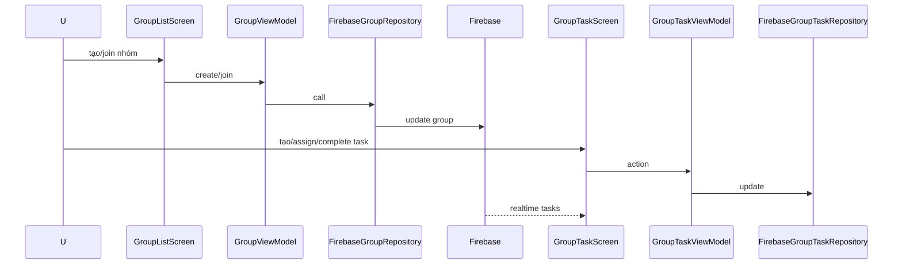
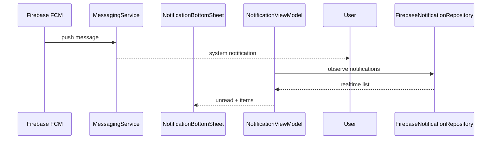

# End-to-End Flows

## Flow 1: Auth + onboarding

```mermaid
sequenceDiagram
    participant U as User
    participant UI as Login/Register UI
    participant VM as AuthViewModel
    participant FA as Firebase Auth
    participant M as MainActivity
    participant O as OnboardingVM

    U->>UI: Login/Register
    UI->>VM: submit credentials
    VM->>FA: auth API
    FA-->>VM: success
    VM-->>M: auth success
    M->>O: check first time
    O-->>M: true/false
    M-->>U: Welcome or Main
```

## Flow 2: Tạo task cá nhân

```mermaid
sequenceDiagram
    U->>MainScreen: bấm FAB
    MainScreen->>AddTaskSheet: mở form
    U->>AddTaskSheet: nhập dữ liệu
    AddTaskSheet->>HomeViewModel: addTask
    HomeViewModel->>FirebaseHomeTaskRepository: addTask
    FirebaseHomeTaskRepository->>Firebase: write task
    Firebase-->>HomeViewModel: realtime update
    HomeViewModel-->>MainScreen: StateFlow mới
```

## Flow 3: Task nhóm

```mermaid
sequenceDiagram
    U->>GroupListScreen: tạo/join nhóm
    GroupListScreen->>GroupViewModel: create/join
    GroupViewModel->>FirebaseGroupRepository: call
    FirebaseGroupRepository->>Firebase: update group
    U->>GroupTaskScreen: tạo/assign/complete task
    GroupTaskScreen->>GroupTaskViewModel: action
    GroupTaskViewModel->>FirebaseGroupTaskRepository: update
    Firebase-->>GroupTaskScreen: realtime tasks
```

## Flow 4: Notification

```mermaid
sequenceDiagram
    participant F as Firebase FCM
    participant S as MessagingService
    participant UI as NotificationBottomSheet
    participant VM as NotificationViewModel

    F->>S: push message
    S-->>User: system notification
    VM->>FirebaseNotificationRepository: observe notifications
    FirebaseNotificationRepository-->>VM: realtime list
    VM-->>UI: unread + items
```
