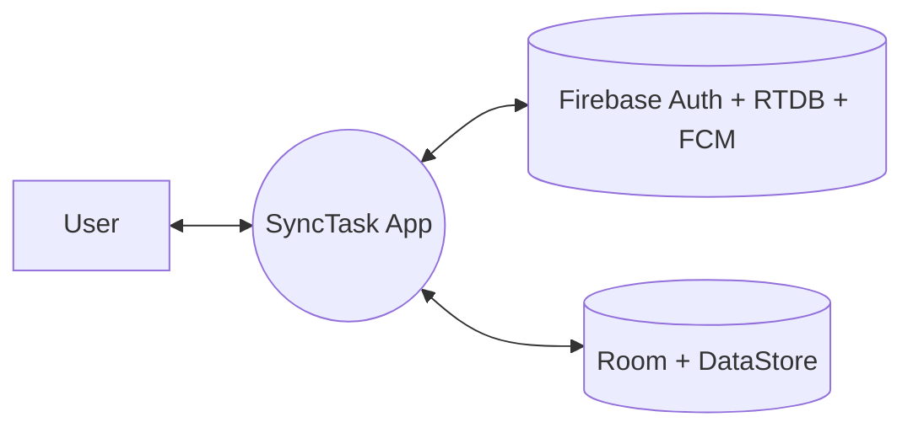
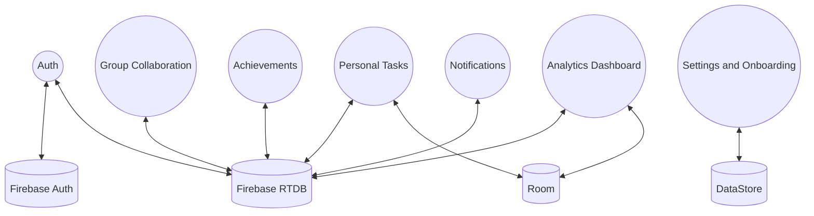
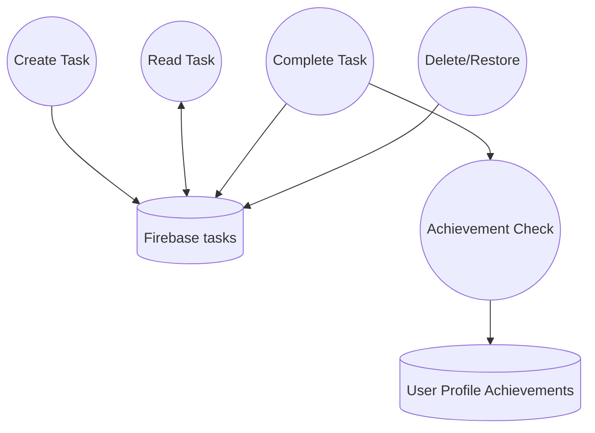
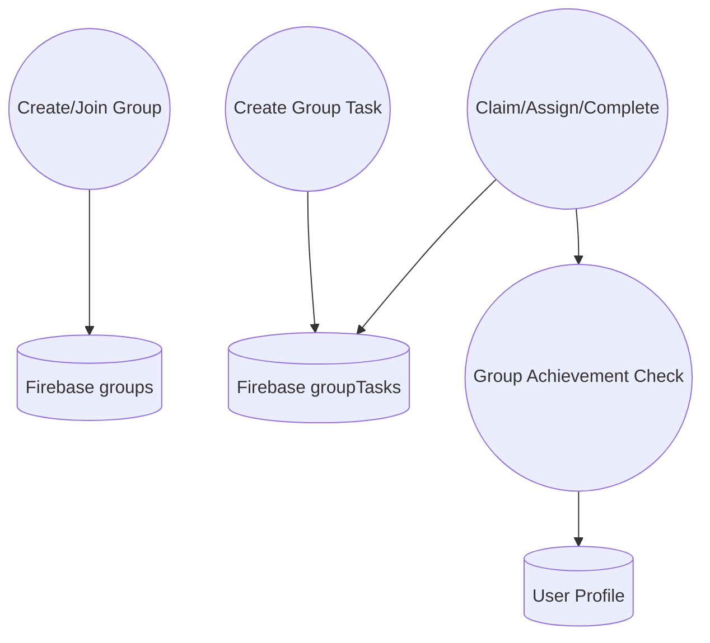

# DFD Levels (Mermaid)

## Level 0 - Context

```mermaid
flowchart LR
    U[User] <--> A((SyncTask App))
    A <--> F[(Firebase Auth + RTDB + FCM)]
    A <--> L[(Room + DataStore)]
```

## Level 1 - Major processes

```mermaid
flowchart TD
    P1((Auth))
    P2((Personal Tasks))
    P3((Group Collaboration))
    P4((Achievements))
    P5((Analytics Dashboard))
    P6((Notifications))
    P7((Settings and Onboarding))

    D1[(Firebase Auth)]
    D2[(Firebase RTDB)]
    D3[(Room)]
    D4[(DataStore)]

    P1 <--> D1
    P1 <--> D2
    P2 <--> D2
    P2 <--> D3
    P3 <--> D2
    P4 <--> D2
    P5 <--> D2
    P5 <--> D3
    P6 <--> D2
    P7 <--> D4
```

## Level 2 - Personal task details

```mermaid
flowchart TD
    A((Create Task)) --> B[(Firebase tasks)]
    C((Read Task)) <--> B
    D((Complete Task)) --> B
    E((Delete/Restore)) --> B
    D --> F((Achievement Check))
    F --> G[(User Profile Achievements)]
```

## Level 2 - Group task details

```mermaid
flowchart TD
    A((Create/Join Group)) --> B[(Firebase groups)]
    C((Create Group Task)) --> D[(Firebase groupTasks)]
    E((Claim/Assign/Complete)) --> D
    E --> F((Group Achievement Check))
    F --> G[(User Profile)]
```
