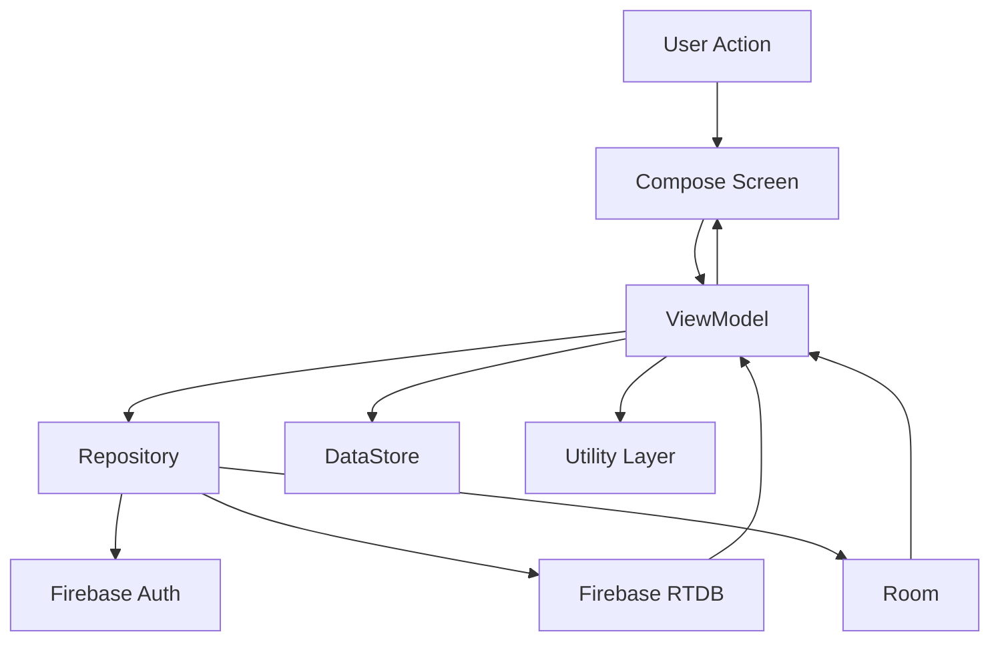
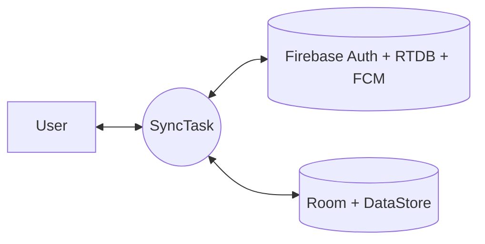
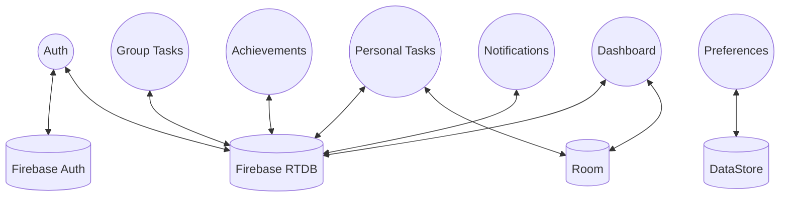

# SyncTask Deep Dive (All-In-One, Siêu Chi Tiết)

## 1. Executive Summary

SyncTask là ứng dụng quản lý công việc Android, tập trung vào:

- Ưu tiên công việc theo Eisenhower Matrix.
- Đồng bộ realtime cá nhân và nhóm.
- Theo dõi tiến độ bằng dashboard.
- Tăng động lực bằng achievement + âm thanh + hiệu ứng.

Câu trả lời ngắn cho người mới:

- App này làm cái chi: quản lý việc cá nhân/nhóm, nhắc việc, đo tiến độ.
- Làm như răng: UI Compose + ViewModel + Repository + Firebase/Room/DataStore.

## 2. Chức năng lớn và chức năng nhỏ

### 2.1 Auth

Chức năng lớn:

- Đăng ký, đăng nhập, quên mật khẩu.

Chức năng nhỏ:

- Sau register thì gửi verify email.
- Nếu tài khoản password chưa verify thì không cho vào luồng chính.
- Khi login thành công sẽ điều hướng theo trạng thái onboarding.

File chính:

- [app/src/main/java/com/phuc/synctask/viewmodel/AuthViewModel.kt](../app/src/main/java/com/phuc/synctask/viewmodel/AuthViewModel.kt)
- [app/src/main/java/com/phuc/synctask/ui/auth/LoginScreen.kt](../app/src/main/java/com/phuc/synctask/ui/auth/LoginScreen.kt)
- [app/src/main/java/com/phuc/synctask/ui/auth/RegisterScreen.kt](../app/src/main/java/com/phuc/synctask/ui/auth/RegisterScreen.kt)

### 2.2 Onboarding

Chức năng lớn:

- Hướng dẫn user mới dùng app lần đầu.

Chức năng nhỏ:

- Hiển thị welcome screen.
- Highlight từng vùng quan trọng bằng spotlight overlay.
- Lưu trạng thái đã xem vào DataStore để không lặp lại.

File chính:

- [app/src/main/java/com/phuc/synctask/ui/onboarding/WelcomeScreen.kt](../app/src/main/java/com/phuc/synctask/ui/onboarding/WelcomeScreen.kt)
- [app/src/main/java/com/phuc/synctask/ui/onboarding/SpotlightOverlay.kt](../app/src/main/java/com/phuc/synctask/ui/onboarding/SpotlightOverlay.kt)
- [app/src/main/java/com/phuc/synctask/viewmodel/OnboardingViewModel.kt](../app/src/main/java/com/phuc/synctask/viewmodel/OnboardingViewModel.kt)

### 2.3 Personal Task

Chức năng lớn:

- Quản lý task cá nhân theo ma trận Eisenhower.

Chức năng nhỏ:

- Tạo task từ bottom sheet.
- Đánh dấu hoàn thành.
- Swipe để thao tác nhanh.
- Xem danh sách chi tiết theo quadrant.
- Tính số task hoàn thành/hôm nay/quá hạn.

File chính:

- [app/src/main/java/com/phuc/synctask/ui/personal/PersonalTaskScreen.kt](../app/src/main/java/com/phuc/synctask/ui/personal/PersonalTaskScreen.kt)
- [app/src/main/java/com/phuc/synctask/ui/personal/QuadrantDetailScreen.kt](../app/src/main/java/com/phuc/synctask/ui/personal/QuadrantDetailScreen.kt)
- [app/src/main/java/com/phuc/synctask/viewmodel/HomeViewModel.kt](../app/src/main/java/com/phuc/synctask/viewmodel/HomeViewModel.kt)
- [app/src/main/java/com/phuc/synctask/data/repository/FirebaseHomeTaskRepository.kt](../app/src/main/java/com/phuc/synctask/data/repository/FirebaseHomeTaskRepository.kt)

### 2.4 Group Collaboration

Chức năng lớn:

- Tạo nhóm, tham gia nhóm, quản lý task nhóm.

Chức năng nhỏ:

- Tạo mã mời.
- Join nhóm bằng code.
- Tạo task nhóm.
- Claim task.
- Assign task cho thành viên.
- Complete task nhóm.
- Cập nhật đóng góp user trong nhóm.

File chính:

- [app/src/main/java/com/phuc/synctask/ui/group/GroupListScreen.kt](../app/src/main/java/com/phuc/synctask/ui/group/GroupListScreen.kt)
- [app/src/main/java/com/phuc/synctask/ui/group/GroupTaskScreen.kt](../app/src/main/java/com/phuc/synctask/ui/group/GroupTaskScreen.kt)
- [app/src/main/java/com/phuc/synctask/viewmodel/GroupViewModel.kt](../app/src/main/java/com/phuc/synctask/viewmodel/GroupViewModel.kt)
- [app/src/main/java/com/phuc/synctask/viewmodel/GroupTaskViewModel.kt](../app/src/main/java/com/phuc/synctask/viewmodel/GroupTaskViewModel.kt)
- [app/src/main/java/com/phuc/synctask/data/repository/FirebaseGroupRepository.kt](../app/src/main/java/com/phuc/synctask/data/repository/FirebaseGroupRepository.kt)
- [app/src/main/java/com/phuc/synctask/data/repository/FirebaseGroupTaskRepository.kt](../app/src/main/java/com/phuc/synctask/data/repository/FirebaseGroupTaskRepository.kt)

### 2.5 Achievement and Motivation

Chức năng lớn:

- Ghi nhận thành tích tự động.

Chức năng nhỏ:

- Check rule achievement theo điều kiện.
- Lưu unlocked achievement vào profile.
- Hiện dialog chúc mừng.
- Phát âm thanh và confetti.

File chính:

- [app/src/main/java/com/phuc/synctask/utils/AchievementManager.kt](../app/src/main/java/com/phuc/synctask/utils/AchievementManager.kt)
- [app/src/main/java/com/phuc/synctask/ui/common/AchievementUnlockedDialog.kt](../app/src/main/java/com/phuc/synctask/ui/common/AchievementUnlockedDialog.kt)
- [app/src/main/java/com/phuc/synctask/ui/achievement/AchievementScreen.kt](../app/src/main/java/com/phuc/synctask/ui/achievement/AchievementScreen.kt)

### 2.6 Notifications

Chức năng lớn:

- Thông báo trong app + push notification.

Chức năng nhỏ:

- Realtime in-app notifications.
- Đếm unread.
- Đánh dấu đã đọc.
- Nhận push qua FCM service.

File chính:

- [app/src/main/java/com/phuc/synctask/viewmodel/NotificationViewModel.kt](../app/src/main/java/com/phuc/synctask/viewmodel/NotificationViewModel.kt)
- [app/src/main/java/com/phuc/synctask/ui/main/NotificationBottomSheet.kt](../app/src/main/java/com/phuc/synctask/ui/main/NotificationBottomSheet.kt)
- [app/src/main/java/com/phuc/synctask/service/SyncTaskMessagingService.kt](../app/src/main/java/com/phuc/synctask/service/SyncTaskMessagingService.kt)
- [app/src/main/java/com/phuc/synctask/data/repository/FirebaseNotificationRepository.kt](../app/src/main/java/com/phuc/synctask/data/repository/FirebaseNotificationRepository.kt)

### 2.7 Dashboard Analytics

Chức năng lớn:

- Tổng hợp số liệu hiệu suất công việc.

Chức năng nhỏ:

- Filter tuần/tháng.
- Tính completed/overdue.
- Tính phân bố Eisenhower.
- Tính workload theo ngày.
- Tính tiến độ nhóm.
- Gợi ý focus tasks.

File chính:

- [app/src/main/java/com/phuc/synctask/ui/dashboard/DashboardScreen.kt](../app/src/main/java/com/phuc/synctask/ui/dashboard/DashboardScreen.kt)
- [app/src/main/java/com/phuc/synctask/viewmodel/DashboardViewModel.kt](../app/src/main/java/com/phuc/synctask/viewmodel/DashboardViewModel.kt)
- [app/src/main/java/com/phuc/synctask/viewmodel/DashboardAnalyticsUseCase.kt](../app/src/main/java/com/phuc/synctask/viewmodel/DashboardAnalyticsUseCase.kt)

### 2.8 Theme and Sound

Chức năng lớn:

- Cá nhân hóa trải nghiệm dùng app.

Chức năng nhỏ:

- Chuyển dark/light.
- Bật/tắt sound.
- Chỉnh volume.
- Mapping âm thanh theo sự kiện.

File chính:

- [app/src/main/java/com/phuc/synctask/viewmodel/ThemeViewModel.kt](../app/src/main/java/com/phuc/synctask/viewmodel/ThemeViewModel.kt)
- [app/src/main/java/com/phuc/synctask/viewmodel/SoundSettingsViewModel.kt](../app/src/main/java/com/phuc/synctask/viewmodel/SoundSettingsViewModel.kt)
- [app/src/main/java/com/phuc/synctask/utils/AppSoundEffects.kt](../app/src/main/java/com/phuc/synctask/utils/AppSoundEffects.kt)

## 3. Mô hình hoạt động chi tiết

## 4. DFD context

## 5. DFD level 1

## 6. Mini checklist để hiểu app trong 10 phút

1. Mở MainActivity để hiểu route bắt đầu.
2. Mở MainScreen để hiểu tab và luồng UI chính.
3. Mở HomeViewModel để hiểu task cá nhân.
4. Mở GroupTaskViewModel để hiểu task nhóm.
5. Mở DashboardViewModel để hiểu thống kê.
6. Mở 4 repository Firebase để hiểu dữ liệu cloud đi như thế nào.

## 7. Kết luận

SyncTask không chỉ là to-do app. Đây là app quản trị ưu tiên công việc theo tư duy Eisenhower, có cộng tác nhóm, có phân tích tiến độ và có cơ chế tạo động lực để người dùng duy trì thói quen làm việc tốt.
