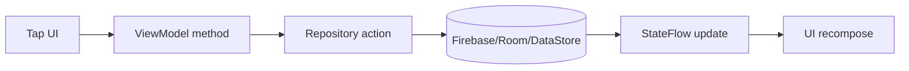

# SyncTask Micro Features Breakdown (Cực Chi Tiết)

## 1. Mục tiêu file

File này trả lời câu hỏi: từng chức năng nhỏ nhỏ trong app là gì, nằm ở đâu, chạy như thế nào.

## 2. Auth micro-features

- Login validation: kiểm tra email/password trống/sai định dạng.
- Register validation: tên, email, mật khẩu, xác nhận mật khẩu.
- Email verification gate: chặn user password chưa verify.
- Reset password: gửi mail đổi mật khẩu.
- Reset auth state khi chuyển màn hình login/register.

Nằm ở:

- [app/src/main/java/com/phuc/synctask/viewmodel/AuthViewModel.kt](../app/src/main/java/com/phuc/synctask/viewmodel/AuthViewModel.kt)
- [app/src/main/java/com/phuc/synctask/ui/auth/LoginScreen.kt](../app/src/main/java/com/phuc/synctask/ui/auth/LoginScreen.kt)
- [app/src/main/java/com/phuc/synctask/ui/auth/RegisterScreen.kt](../app/src/main/java/com/phuc/synctask/ui/auth/RegisterScreen.kt)

## 3. Main shell micro-features

- Hiển thị initials từ tên/email user.
- Nút xem lại tutorial.
- Nút mở notification sheet.
- Nút mở sound dialog.
- Nút toggle theme.
- Nút logout.
- FAB chỉ hiện ở tab Personal.
- Bottom navigation giữ state khi đổi tab.

Nằm ở:

- [app/src/main/java/com/phuc/synctask/ui/main/MainScreen.kt](../app/src/main/java/com/phuc/synctask/ui/main/MainScreen.kt)

## 4. Personal task micro-features

- Tạo task với title/description/urgent/important/dueDate.
- Chuyển task vào quadrant theo urgent+important.
- Swipe gesture để thao tác nhanh.
- Toggle isCompleted.
- Xóa task.
- Khôi phục task.
- Đếm task completed/today/overdue.
- Cảnh báo workload cao theo effort.

Nằm ở:

- [app/src/main/java/com/phuc/synctask/viewmodel/HomeViewModel.kt](../app/src/main/java/com/phuc/synctask/viewmodel/HomeViewModel.kt)
- [app/src/main/java/com/phuc/synctask/ui/personal/PersonalTaskScreen.kt](../app/src/main/java/com/phuc/synctask/ui/personal/PersonalTaskScreen.kt)
- [app/src/main/java/com/phuc/synctask/ui/home/HomeScreen.kt](../app/src/main/java/com/phuc/synctask/ui/home/HomeScreen.kt)
- [app/src/main/java/com/phuc/synctask/ui/main/AddTaskBottomSheet.kt](../app/src/main/java/com/phuc/synctask/ui/main/AddTaskBottomSheet.kt)
- [app/src/main/java/com/phuc/synctask/utils/WorkloadChecker.kt](../app/src/main/java/com/phuc/synctask/utils/WorkloadChecker.kt)

## 5. Group micro-features

- Tạo nhóm mới.
- Sinh mã mời nhóm.
- Join nhóm bằng code.
- Atomic add member bằng transaction.
- Load info nhóm realtime.
- Load task nhóm realtime.
- Tạo task nhóm.
- Claim task nhóm.
- Assign task nhóm.
- Complete task nhóm.
- Restore task nhóm.

Nằm ở:

- [app/src/main/java/com/phuc/synctask/viewmodel/GroupViewModel.kt](../app/src/main/java/com/phuc/synctask/viewmodel/GroupViewModel.kt)
- [app/src/main/java/com/phuc/synctask/viewmodel/GroupTaskViewModel.kt](../app/src/main/java/com/phuc/synctask/viewmodel/GroupTaskViewModel.kt)
- [app/src/main/java/com/phuc/synctask/data/repository/FirebaseGroupRepository.kt](../app/src/main/java/com/phuc/synctask/data/repository/FirebaseGroupRepository.kt)
- [app/src/main/java/com/phuc/synctask/data/repository/FirebaseGroupTaskRepository.kt](../app/src/main/java/com/phuc/synctask/data/repository/FirebaseGroupTaskRepository.kt)

## 6. Achievement micro-features

- Rule unlock rookie/diligent/warrior/legend.
- Rule unlock night owl.
- Rule unlock on-time.
- Rule unlock team player/captain.
- Tránh unlock trùng trong session.
- Dialog achievement tự đóng theo thời gian.

Nằm ở:

- [app/src/main/java/com/phuc/synctask/utils/AchievementManager.kt](../app/src/main/java/com/phuc/synctask/utils/AchievementManager.kt)
- [app/src/main/java/com/phuc/synctask/ui/common/AchievementUnlockedDialog.kt](../app/src/main/java/com/phuc/synctask/ui/common/AchievementUnlockedDialog.kt)

## 7. Notification micro-features

- Observe notification realtime.
- Đếm unread realtime.
- Mark-as-read từng item.
- Mark-all-as-read.
- Badge unread trên top bar.
- Nhận push FCM vào system tray.

Nằm ở:

- [app/src/main/java/com/phuc/synctask/viewmodel/NotificationViewModel.kt](../app/src/main/java/com/phuc/synctask/viewmodel/NotificationViewModel.kt)
- [app/src/main/java/com/phuc/synctask/data/repository/FirebaseNotificationRepository.kt](../app/src/main/java/com/phuc/synctask/data/repository/FirebaseNotificationRepository.kt)
- [app/src/main/java/com/phuc/synctask/service/SyncTaskMessagingService.kt](../app/src/main/java/com/phuc/synctask/service/SyncTaskMessagingService.kt)
- [app/src/main/java/com/phuc/synctask/ui/main/NotificationBottomSheet.kt](../app/src/main/java/com/phuc/synctask/ui/main/NotificationBottomSheet.kt)

## 8. Dashboard micro-features

- Chọn bộ lọc tuần/tháng.
- Tính tổng completed cá nhân.
- Tính tổng completed nhóm.
- Tính overdue count.
- Tính Eisenhower stats.
- Tính workload timeline.
- Tính group progress.
- Tạo danh sách focus tasks.

Nằm ở:

- [app/src/main/java/com/phuc/synctask/viewmodel/DashboardViewModel.kt](../app/src/main/java/com/phuc/synctask/viewmodel/DashboardViewModel.kt)
- [app/src/main/java/com/phuc/synctask/viewmodel/DashboardAnalyticsUseCase.kt](../app/src/main/java/com/phuc/synctask/viewmodel/DashboardAnalyticsUseCase.kt)
- [app/src/main/java/com/phuc/synctask/ui/dashboard/DashboardScreen.kt](../app/src/main/java/com/phuc/synctask/ui/dashboard/DashboardScreen.kt)

## 9. Settings micro-features

- Toggle dark mode.
- Toggle sound enable.
- Set volume percent.
- Persist settings qua DataStore.
- Apply setting lúc app resume.

Nằm ở:

- [app/src/main/java/com/phuc/synctask/viewmodel/ThemeViewModel.kt](../app/src/main/java/com/phuc/synctask/viewmodel/ThemeViewModel.kt)
- [app/src/main/java/com/phuc/synctask/viewmodel/SoundSettingsViewModel.kt](../app/src/main/java/com/phuc/synctask/viewmodel/SoundSettingsViewModel.kt)
- [app/src/main/java/com/phuc/synctask/utils/AppSoundEffects.kt](../app/src/main/java/com/phuc/synctask/utils/AppSoundEffects.kt)

## 10. DFD nhỏ cho micro-feature path

## 11. Câu trả lời 1 dòng cho người không rành kỹ thuật

- App này giúp bạn và nhóm quản lý việc làm theo thứ tự ưu tiên, có nhắc việc, có thống kê, có thành tựu, và mọi thứ cập nhật realtime.
